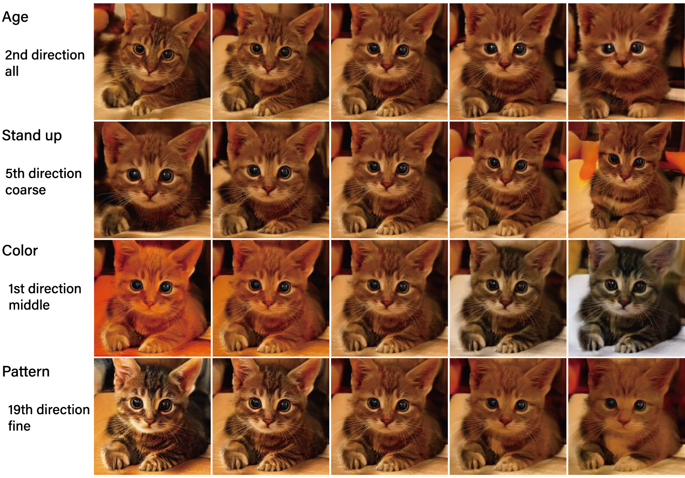

# Do Not Escape From the Manifold: Discovering the Local Coordinates on the Latent Space of GANs



<p align="justify"><b>Figure 1:</b> Semantic factorization through constrained traversal. The examples are discovered by constraining the latent traversal to a subset of the layers. The subset is chosen among the coarse, middle, and fine layers defined by StyleGAN. It can be seen that semantics are well factorized.</p>

## Setup
1. Create environment: `conda create -n local_basis python=3.7`
2. Activate environment: `conda activate local_basis`
3. Install dependencies: `conda env update -f environment.yml --prune`
4. `cd models/stylegan2/stylegan2-pytorch/op`
5. `python setup.py install`
6. Test: `python -c "import torch; import upfirdn2d_op; import fused; print('OK')"`

## Usage
All code is implemented in jupyter notebook.

## Reproducibility


### StyleGAN
1. Install TensorFlow: `conda install tensorflow-gpu=1.*`.
2. Modify methods `__init__()`, `load_model()` in `models/wrappers.py` under class StyleGAN.

### StyleGAN2
1. Follow the instructions in [models/stylegan2/stylegan2-pytorch/README.md](https://github.com/harskish/stylegan2-pytorch/blob/master/README.md#convert-weight-from-official-checkpoints). Make sure to use the fork in this specific folder when converting the weights for compatibility reasons.
2. Save the converted checkpoint as `checkpoints/stylegan2/<dataset>_<resolution>.pt`.
3. Modify methods `__init__()`, `download_checkpoint()` in `models/wrappers.py` under class StyleGAN2.


## Citation
```
```

## License

The files `models/wrappers.py`, `notebooks/ganspace_utils.py` and `notebooks/notebook_utils.py` are a derivative of the [GANSpace][ganspace], and are provided under the [Apache 2.0](LICENSE) license.<br>
The directory `netdissect` is a derivative of the [GAN Dissection][gandissect] project, and is provided under the MIT license.<br>
The directories `models/biggan` and `models/stylegan2` are provided under the MIT license.


[biggan_pytorch]: https://github.com/huggingface/pytorch-pretrained-BigGAN
[stylegan_pytorch]: https://github.com/lernapparat/lernapparat/blob/master/style_gan/pytorch_style_gan.ipynb
[stylegan2_pytorch]: https://github.com/rosinality/stylegan2-pytorch
[gandissect]: https://github.com/CSAILVision/GANDissect
[pretrained_stylegan]: https://github.com/justinpinkney/awesome-pretrained-stylegan
[ganspace]: https://github.com/harskish/ganspace
